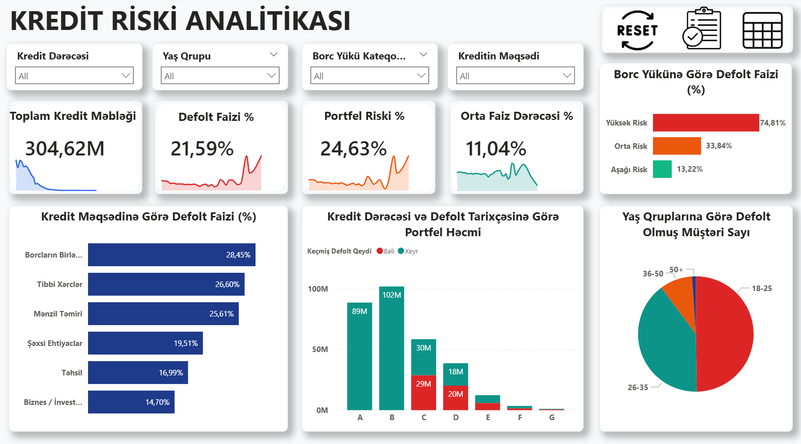
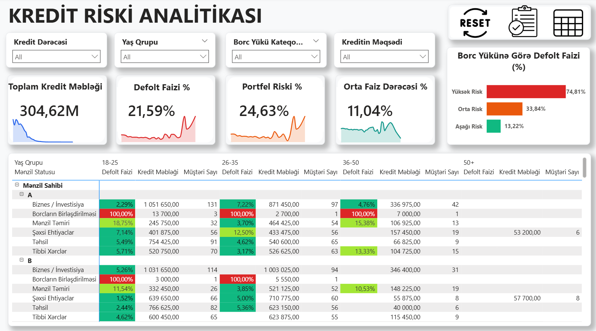

# 📊 End-to-End Credit Risk & Portfolio Analytics Pipeline


## 📌 Executive Summary
This project is a comprehensive **End-to-End Data Analytics Pipeline** designed to assess credit portfolio risk, identify critical default hotspots, and provide actionable intelligence for financial risk management. By extracting raw data from Kaggle, transforming it via Python, loading it into PostgreSQL, and designing an enterprise-grade interactive dashboard in Power BI, this project uncovers the precise demographic and behavioral drivers of loan defaults.

---

## 🎯 Business Problem & Objectives
Financial institutions face significant revenue loss due to non-performing loans (NPLs) and defaults. The objective of this project is to:
1. **Identify High-Risk Segments:** Pinpoint which demographic attributes (Age, Homeownership) and financial indicators (Risk Tiers, Historical Defaults) drive the highest default rates.
2. **Optimize Underwriting Strategies:** Evaluate the performance of different loan grades (A-G) and loan intents to adjust future interest rates and approval criteria.
3. **Develop a Monitoring Tool:** Create a dynamic, self-service Power BI application that allows risk executives to seamlessly drill down from high-level portfolio KPIs to granular risk heatmaps.

---

## 🏗️ Tech Stack & End-to-End Architecture

The project follows a robust ETL and analytical pipeline:

1. **Data Source:** Kaggle Credit Risk Dataset.
2. **Data Extraction & Cleaning (Python):** 
   - Handled missing data via median imputation (`person_emp_length`, `loan_int_rate` by grade).
   - Engineered new features using `Pandas`: `age_group` (18-25, 26-35, 36-50, 50+) and `loan_risk_tier` (Aşağı, Orta, Yüksək).
3. **Database Management (PostgreSQL):** 
   - Loaded the cleaned dataset using `SQLAlchemy`.
   - Executed advanced SQL queries to validate aggregations and extract preliminary analytical insights.
4. **Data Visualization (Power BI):** 
   - Built a localized (Azerbaijani) BI application featuring DAX data modeling, dynamic bookmarks, and conditional formatting.

---

## 🖼️ Interactive Dashboard Features

### 1. Executive Summary View
Features dynamic KPI cards with embedded **Sparkline trend lines**, providing an immediate pulse on the portfolio's health (Total Loan Amount, Default Rate %, Portfolio Risk %, Avg Interest Rate).
> 

### 2. Deep-Dive Risk Heatmap View (Matrix)
Utilizes **Dynamic Bookmark Navigation** to seamlessly switch to a 5-tier conditional formatting matrix (0% to 100%). This reveals the cross-sectional risk between Homeownership, Loan Grade, and Age Groups.
> 

### 💡 Core UX Enhancements
- **Custom Navigation:** Bookmark action buttons to toggle between charts and matrix views without losing filter context.
- **One-Click Reset:** A dedicated "Reset Slicers" button to instantly clear all applied filters and revert to the baseline portfolio view.

---

## 📊 Analytical SQL Queries 

Prior to visualization, the data was rigorously analyzed in PostgreSQL using 5 core queries (available in `scripts/02_credit_risk_queries.sql`):
1. **`01_table_inspection.sql`:** Schema verification and data integrity checks.
2. **`02_portfolio_kpi_summary.sql`:** Calculated core metrics (e.g., establishing the baseline 21.59% default rate).
3. **`03_default_by_grade_and_intent.sql`:** Grouped default rates by credit scores (A-G) and borrower intent (Medical, Education, Debt Consolidation).
4. **`04_risk_tier_and_history_analysis.sql`:** Cross-analyzed debt-to-income tiers against historical default records to map severe risk clusters.
5. **`05_homeownership_age_matrix.sql`:** Investigated the demographic correlation between renting status, youth (18-25), and default likelihood.

---

## 💡 Key Business Insights (Data Findings)

Based on the overall portfolio volume of **$304.62M** and an average default rate of **21.59%**, the following patterns were uncovered:

* **The "Renters" Danger Zone:** Borrowers who rent their homes and fall into lower credit grades (E, F, G) exhibit astronomical default rates ranging from **70% to 87.27%**.
* **Debt-to-Income is Critical:** The engineered `loan_risk_tier` proved highly predictive. Customers categorized in the **Yüksək Risk (High Risk)** tier default at a rate of **74.81%**, compared to just 13.22% for low-risk borrowers.
* **Historical Behavior Repeats:** Borrowers with a prior default on record ("Keçmiş Defolt Qeydi = Bəli") carry an overwhelmingly high risk compared to first-time defaulters, validating the necessity of strict historical background checks.
* **Loan Purpose Dynamics:** Loans taken out for **Debt Consolidation (28.45%)** and **Medical Expenses (26.60%)** hold the highest default ratios, whereas Venture/Investment loans perform significantly better (14.70%).

---

## 🛡️ Strategic Recommendations

1. **Stricter Underwriting for Renters:** Implement tighter debt-to-income caps for non-homeowners, specifically those aged 18-25, as they represent the most volatile demographic.
2. **Halt Grade F & G Approvals:** The risk heatmap dictates that Grade F and G loans are economically unviable. It is recommended to either cease approvals for these grades or require substantial collateral.
3. **Restructure Debt Consolidation Products:** Given the high default rate (28.45%), debt consolidation loans should require mandatory financial counseling or co-signers to mitigate exposure.
4. **Automated Flagging:** Integrate the High-Risk Tier parameters directly into the credit approval API to automatically flag or reject applications exceeding the defined debt-to-income threshold.

---

## 📁 Repository Structure

```text
credit-risk-analytics/
│
├── data/
│   ├── credit_risk_dataset.csv           # Raw Kaggle dataset
│   └── cleaned_credit_risk_dataset.csv   # Processed data via Python
│
├── scripts/
│   ├── 01_credit_risk_data_cleaning.ipynb # Python ETL (Pandas, Missing values, Feature Eng)
│   └── 02_credit_risk_queries.sql         # 5 Analytical PostgreSQL Queries
│
├── images/
│   ├── overview_dashboard.png            # Dashboard View 1
│   └── matrix_heatmap_view.png           # Dashboard View 2
│
├── Credit_Risk_Analysis.pbix             # Core Power BI File
└── README.md                             # Project Documentation
